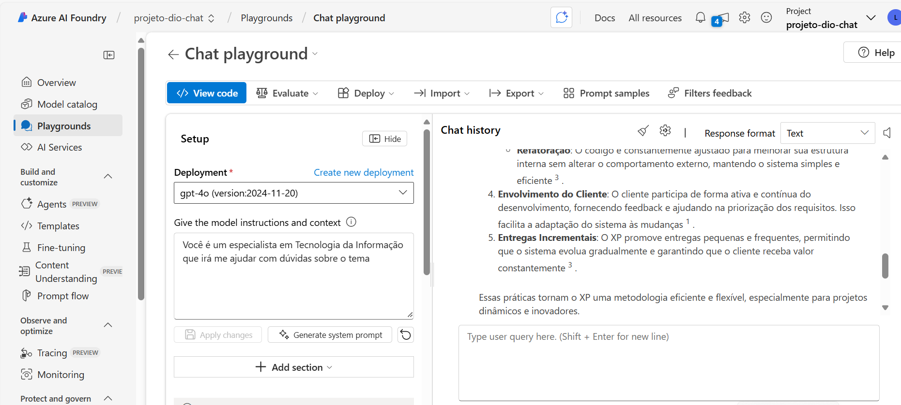
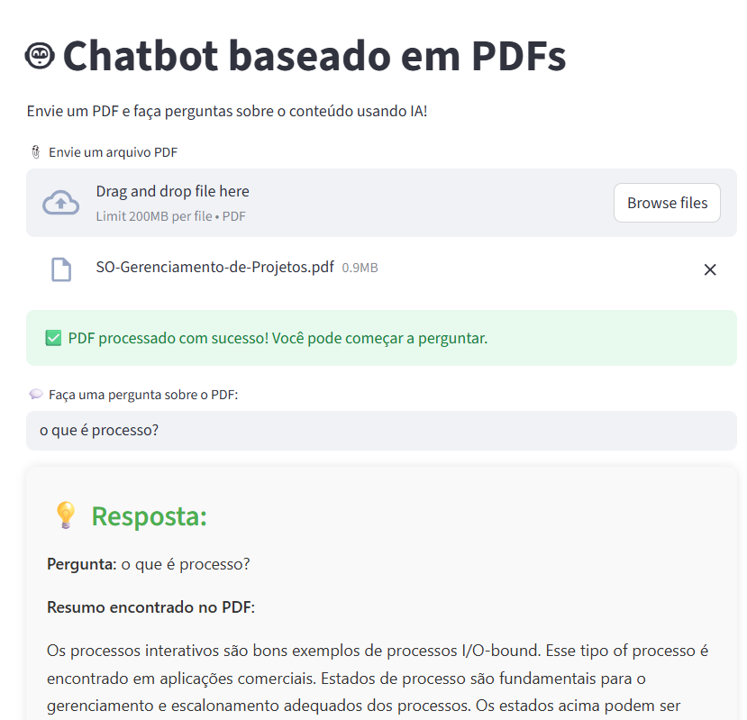

# 🤖 Projeto Chatbot Inteligente com Azure AI Foundry

  
  
  
  

## ✨ Sobre o Projeto: Da Ideia à IA em Produção!

Este projeto é o resultado prático do curso da **Digital Innovation One (DIO)**, focado na criação e implementação de um **Chatbot** robusto e inteligente utilizando a **Azure AI Foundry**.

O Azure AI Foundry é uma "fábrica" de IA, uma plataforma unificada que simplifica o ciclo de vida completo de aplicativos de IA generativa, desde a prototipagem até o deploy em escala. Onde transformamos um simples modelo de linguagem em um agente conversacional pronto para o uso.

### 🎯 Objetivo Principal

* **Aprender a Plataforma:** Dominar o uso da **Azure AI Foundry** para orquestrar recursos de Large Language Models (LLMs).
* **Criar um Chatbot:** Desenvolver um agente de conversação funcional, capaz de interagir de forma contextualizada.
* **Deploy (Escala):** Preparar e implementar a solução em um ambiente de nível de produção na nuvem.

---

## 🛠️ Tecnologias Utilizadas (The Stack)

A combinação perfeita de ferramentas para construir uma solução de IA de ponta:

* **Cloud Platform:**
    * `Azure AI Foundry`: Plataforma unificada para desenvolvimento, deploy e gestão de aplicações de IA.
    * `Azure OpenAI Service`: Acesso a modelos de ponta como GPT-3.5/GPT-4.
    * `Azure AI Search (ou similar)`: Para o uso de RAG (*Retrieval Augmented Generation*) e prover dados externos ao modelo.
* **Linguagem de Programação:**
    * `Python`: A linguagem padrão para desenvolvimento de IA/ML.
* **Bibliotecas/Frameworks:**
    * `[Nome da Biblioteca]` (Ex: SDK do Azure AI Foundry, Semantic Kernel, LangChain)

---
## 📸 Prints do Projeto

Abaixo, uma captura de tela mostrando o ambiente do **Azure AI Foundry** usado para testes e integração do chatbot e do app Streamlit:

---

### 📚 Materiais de Apoio & Agradecimentos

Este projeto só foi possível graças aos instrutores e à excelente curadoria da **Digital Innovation One (DIO)**.

* **Bootcamp DIO:** [https://web.dio.me/track/2518d8d7-662d-44e8-8f55-8fcda09aa25a]
* **Documentação Oficial:** [Azure AI Foundry - O que é?](https://learn.microsoft.com/en-us/azure/ai-foundry/what-is-azure-ai-foundry)
* **Exemplos Microsoft:** [https://github.com/MicrosoftLearning/mslearn-azure-ml]

> *Feito com 💙 e inteligência artificial durante o Bootcamp DIO.*